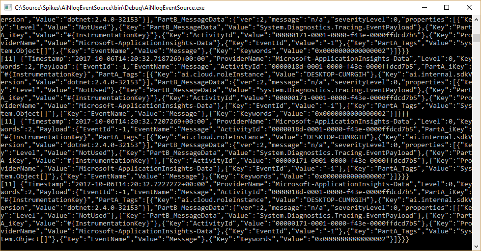
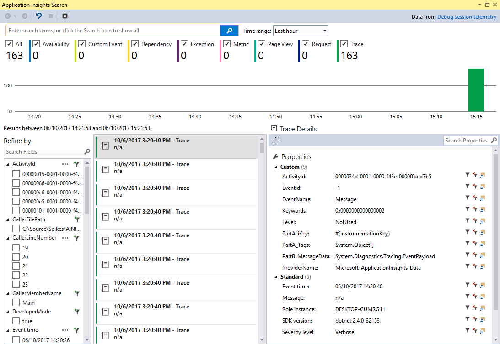
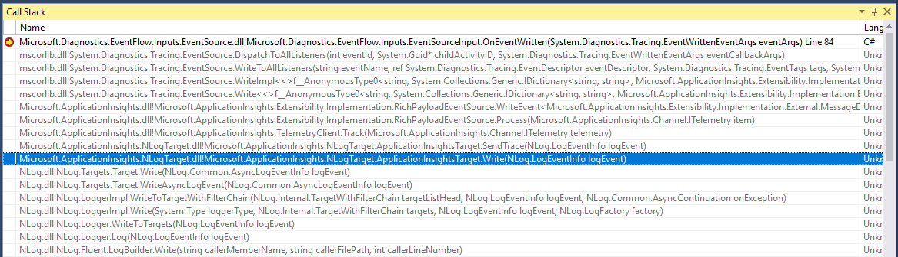

# AiNlogEventSource
Reproduction of issue combining ApplicationInsights, EventFlow and NLog

## Description

I wish to output events written to an [EventSource](https://msdn.microsoft.com/en-us/library/system.diagnostics.tracing.eventsource.aspx) to both StdOut and ApplicationInsights. As such I used EventFlow to listen to events from the EventSource and write the output to both destinations (I had previously tried using [ApplicationInsights.EventSourceListener](https://www.nuget.org/packages/Microsoft.ApplicationInsights.EventSourceListener/) but, for reasons yet to be determined, it simply would not capture any output to ApplicationInsights). Anyway, this seems to work fine and output is indeed written to both destinations as expected.

Now I also wish to add nlog output to ApplicationInsights so installed the [ApplicationInsights.NLogTarget](https://www.nuget.org/packages/Microsoft.ApplicationInsights.NLogTarget/). Again, this seems to work fine in simple scenarios.

Unfortunately, in the above scenario, if you delay writing to NLog long enough for other libraries to initialize themselves fully, when the first NLog message is written you will see a screen full of data containing event output from the "Microsoft-ApplicationInsights-Data" event source and the program enters a perpetual loop of writing data to the EventFlow output (including - most damagingly - the ApplicationInsights output).


## Steps to reproduce

1. Start new console app
1. Install [Microsoft.ApplicationInsights.WindowsServer](https://www.nuget.org/packages/Microsoft.ApplicationInsights.WindowsServer/)
1. Add an 'InstrumentationKey' (doesn't matter if it's valid or not) to the (automatically created) ApplicationInsights.config file.
1. Set BuildAction for ApplicationInsights.config to "Content"
1. Install [Microsoft.ApplicationInsights.NLogTarget](https://www.nuget.org/packages/Microsoft.ApplicationInsights.NLogTarget)
1. Install [Microsoft.Diagnostics.EventFlow.Inputs.EventSource](https://www.nuget.org/packages?q=Microsoft.Diagnostics.EventFlow.Inputs.EventSource)
1. Install [Microsoft.Diagnostics.EventFlow.Outputs.StdOutput](https://www.nuget.org/packages/Microsoft.Diagnostics.EventFlow.Outputs.StdOutput/)
1. Install [Microsoft.Diagnostics.EventFlow.Outputs.ApplicationInsights](https://www.nuget.org/packages?q=Microsoft.Diagnostics.EventFlow.Outputs.ApplicationInsights)
1. Add eventFlowConfig.json and set Copy to Output Directory to "Copy if newer"
```
{
  "inputs": [
    {
      "type": "EventSource",
      "sources": [
        {
          "providerName": "AiNlogEventSource-Instrumentation",
          "level": "LogAlways"
        }
      ]
    }
  ],
  "filters": [],
  "outputs": [
    {
      "type": "StdOutput"
    },
    {
      "type": "ApplicationInsights",
      "instrumentationKey": "#{InstrumentationKey}",
      "configurationFilePath": "ApplicationInsights.config"
    }
  ],
  "schemaVersion": "2016-08-11",
  // "healthReporter": {
  //   "type": "CsvHealthReporter",
  //   "logFileFolder": ".",
  //   "logFilePrefix": "HealthReport",
  //   "minReportLevel": "Warning",
  //   "throttlingPeriodMsec": "1000"
  // },
  // "settings": {
  //    "pipelineBufferSize": "1000",
  //    "maxEventBatchSize": "100",
  //    "maxBatchDelayMsec": "500",
  //    "maxConcurrency": "8",
  //    "pipelineCompletionTimeoutMsec": "30000"
  // },
  "extensions": []
}
```
10. Add Instrumentation.cs
```
[EventSource(Name = "AiNlogEventSource-Instrumentation")]
public class Instrumentation : EventSource
{
    public static readonly Instrumentation Log = new Instrumentation();

    [Event(1, Message = "Started")]
    public void Started()
    {
        WriteEvent(1);
    }


    [Event(2, Message = "Stopped")]
    public void Stopped()
    {
        WriteEvent(2);
    }
}
```
11. Add EventFlow initialization, instrumentation and NLog writing to Program.cs
```
static void Main(string[] args)
{
    using (var pipeline = DiagnosticPipelineFactory.CreatePipeline("eventFlowConfig.json"))
    {
        Instrumentation.Log.Started();

        // Give other eventsources a chance to load and be enabled
        Task.Delay(TimeSpan.FromSeconds(1)).ContinueWith(
            _ =>
            {
                Log.Trace().Message("Trace").Write();
                Log.Debug().Message("Debug").Write();
                Log.Info().Message("Info").Write();
                Log.Warn().Message("Warn").Write();
                Log.Error().Message("Error").Write();
                Log.Fatal().Message("Fatal").Write();
            }
        );

        Console.WriteLine("Hit <Return> to exit");
        Console.ReadLine();

        Instrumentation.Log.Stopped();
    }
}
```

_Note: I have purposfully made as few changes to auto-generated files as possible but the issue persists regardless of the content of ApplicationInsights.config (with exception of the notes below)_

## Outcome

When the above is run, the program enters a state of perpetually writing events from the "Microsoft-ApplicationInsights-Data" EventSource to the EventFlow outputs. This can be seen in the console output here:



And the (local) ApplicationInsights search tool shown here:



## Investigation

By cloning EventFlow and building a debug version of Microsoft.Diagnostics.EventFlow.Inputs.EventSource (and temporarily disabling the strong name check), I was able to break at the pertinent points in the EventSourceInput.cs file. The following was noted:

1. A call to ```OnEventSourceCreated``` was made for the 'Microsoft-ApplicationInsights-Data' event source and passed to the 'EnableAsNecessary' method. As the 'Microsoft-ApplicationInsights-Data' was not included in the EventFlow config (and not a 'special case') no call to ```EnableEvents``` was made.
2. A subsequent call to ```OnEventWritten``` is (incorrectly) made for an event from the 'Microsoft-ApplicationInsights-Data' event source and, as it's not a 'special case', passed to the output subject and, ultimately, the output modules.

This can be seen in the call stack here:



This sequence of events ceases to occur in any of the following conditions:

1. The EventSource input for EventFlow is removed from configuration (or it's source list left empty due to the EventSourceInput configuration being invalid).
2. The ApplicationInsights output for EventFlow being removed from configuration
3. The ```<InstrumentationKey>``` element being removed from the ApplicationInsights.config file.
4. Output written to the NLog output synchronously at startup

The last point here is particularly pertinent. As can be seen in the code within _Program.cs_ (shown above), a delay is introduced prior to writing to nlog to allow other libraries to complete initialization. __It is my belief that, one of these libraries (perhaps Microsoft.Diagnostics.EventFlow.Outputs.ApplicationInsights is enabling the 'Microsoft-ApplicationInsights-Data' EventSource causing the additional output and resultant recursive loop.__

